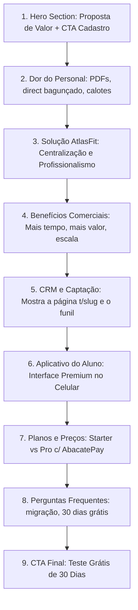

# AtlasFit — Landing Page Research & Product Audit

Este documento apresenta a auditoria técnica e funcional completa do ecossistema **AtlasFit**, servindo como base estratégica, de copywriting, SEO e UI/UX para a criação de uma landing page institucional de alto nível e com foco em conversão.

---

## 1. Visão Geral do AtlasFit

### O que é o AtlasFit
O **AtlasFit** é um SaaS (Software as a Service) *multi-tenant* e *multi-workspace* voltado para a gestão de assessoria esportiva, consultoria fitness online e personal trainers. A plataforma opera de forma similar ao Slack ou Notion: o usuário possui uma conta única global e pode criar ou participar de múltiplos workspaces (tenants), cada um com dados estritamente isolados por `workspaceId` no banco de dados.

### O problema que resolve
Personal trainers e assessorias esportivas costumam sofrer com a pulverização de ferramentas: usam planilhas de Excel para treinos, WhatsApp para atendimento, links avulsos para captação, e-mail para avisos, planilhas financeiras para cobrança e arquivos locais no celular para avaliações físicas. Isso gera perda de tempo, desorganização comercial, atrasos em cobranças (inadimplência) e baixo engajamento/retenção dos alunos.
O AtlasFit consolida todo o ciclo de vida do aluno em um único lugar: da atração (captação de leads) e vendas à prescrição de treinos, avaliação física, cobrança automática e acompanhamento de rotina.

### Para quem foi criado (Público Primário)
1. **Personal Trainers Individuais**: Profissionais que querem escalar sua consultoria online ou presencial com uma interface própria e de alta percepção de valor.
2. **Assessorias Esportivas e Academias (Workspace Owners)**: Empresas fitness que gerenciam equipes de treinadores, controle de caixa de alunos e pretendem rodar sob um modelo estruturado de workspaces compartilhados.

### Proposta de Valor
*"Transforme sua assessoria esportiva em um negócio profissional de alta performance: gerencie alunos, prescreva treinos complexos em segundos, reduza a inadimplência com cobranças automáticas e capte novos leads com um funil de vendas integrado em uma única plataforma premium."*

### Posicionamento de Mercado
O AtlasFit se posiciona como uma plataforma **Premium e Científica**. Ele foge do visual ultrapassado de softwares de academia tradicionais e adota uma estética minimalista, *dark mode-first*, com visualizações ricas de performance de cargas, gráficos de dobras cutâneas e controle de volume de treino. É uma ferramenta de trabalho séria e de alto nível estético para o profissional justificar um valor de tíquete mais alto (High Ticket).

---

## 2. Público-Alvo & Personas

Com base no banco de dados e nos fluxos analisados, identificamos três personas principais na plataforma:

### Persona 1: O Personal Trainer Digital (Trainer)
*   **Perfil**: Profissional de educação física que atua de forma híbrida (presencial e online). Busca escalar seu faturamento atendendo mais alunos por consultoria online.
*   **Dores**: 
    *   Gargalo de tempo ao prescrever treinos individualizados.
    *   Inadimplência de alunos esquecidos.
    *   Dificuldade de atrair novos contatos de forma profissional (costuma usar apenas o direct do Instagram).
    *   Falta de histórico organizado de cargas dos alunos.
*   **Objetivos**: Dobrar o número de alunos de consultoria ativa sem dobrar a carga de trabalho.
*   **Como o AtlasFit resolve**: Fornece um construtor de treinos rápido com modelos reutilizáveis, gera um link de captação de leads exclusivo (`t/[slug]`), monitora a inatividade de alunos automaticamente e fornece gráficos interativos para mostrar a evolução do cliente na avaliação presencial ou online.

### Persona 2: O Gestor de Assessoria (Workspace Owner)
*   **Perfil**: Dono de uma consultoria coletiva ou estúdio fitness que contrata outros treinadores auxiliares.
*   **Dores**: 
    *   Dificuldade em controlar a carteira de alunos distribuída entre múltiplos profissionais.
    *   Falta de padronização nas planilhas e no visual da marca da assessoria.
    *   Descontrole no faturamento consolidado.
*   **Objetivos**: Centralizar a gestão da equipe de professores (staff), padronizar a biblioteca de exercícios da marca e monitorar métricas financeiras globais (MRR/ARR).
*   **Como o AtlasFit resolve**: Fornece um modelo de workspace com permissões de staff (`WorkspaceRole: OWNER, TRAINER, ASSISTANT`), biblioteca de exercícios customizável para o workspace e painel financeiro consolidado de recebimentos.

### Persona 3: O Aluno Focado (Student)
*   **Perfil**: Praticante de musculação ou atleta amador que contrata o personal trainer para obter resultados reais de hipertrofia, emagrecimento ou performance.
*   **Dores**: 
    *   Esquecer a carga do último treino.
    *   Não saber executar o exercício de forma correta ao treinar sozinho.
    *   Não perceber evolução física no espelho a curto prazo.
*   **Objetivos**: Executar os treinos prescritos com constância e facilidade, monitorando marcas pessoais (PRs) e peso/medidas.
*   **Como o AtlasFit resolve**: Aplicativo do aluno otimizado para celular com timer de descanso automático, histórico de cargas anteriores exibido diretamente na tela de execução, player de vídeo do exercício e aba de evolução com gráficos interativos e fotos comparativas.

---

## 3. Mapeamento de Funcionalidades do Sistema

A análise dos módulos contidos em `src/app` e do modelo em `prisma/schema.prisma` revela as seguintes funcionalidades:

### A. Funcionalidades Totalmente Implementadas (Prontas)

1.  **SaaS Multi-Workspace**: Isolamento lógico de dados, permitindo que um usuário participe de múltiplos workspaces (`WorkspaceMember` com roles diferenciados).
2.  **Módulo CRM & Leads (`(personal)/personal/crm`)**:
    *   Funil de vendas no estilo Kanban (status: `new`, `contacted`, `scheduled`, `proposal`, `negotiation`, `won`, `lost`).
    *   Métricas de vendas integradas (taxa de conversão, receita potencial e convertida, tempo médio de fechamento).
    *   Formulário de captura público (`/t/[slug]`) que converte visitantes em registros de `PendingStudent` no workspace do treinador.
    *   Atividades do lead (logs automáticos) e criação de tarefas específicas por lead com prioridades (`BAIXA`, `MEDIA`, `ALTA`) e prazos.
    *   Criação de tags personalizadas de CRM com cores e campos dinâmicos customizados por workspace (`CustomFieldDefinition` e `CustomFieldValue`).
3.  **Prescrição de Treinos (`(personal)/personal/workouts`)**:
    *   Builder completo de treinos associados a dias da semana.
    *   Biblioteca de grupos musculares (`MuscleGroup`) e exercícios (`Exercise`) com controle de aprovação e suporte a links de vídeos de execução.
    *   Suporte a técnicas avançadas de treinamento via grupos de séries (`WorkoutExerciseGroup` com enums: `DROPSET`, `REST_PAUSE`, `BISET`, `TRISET`, `CIRCUIT`).
4.  **Aplicativo de Execução do Aluno (`(student)/student/workout-execution` e `workouts`)**:
    *   Modo de execução passo a passo otimizado para mobile com cronômetro de descanso integrado.
    *   Campos de digitação de carga e repetições reais efetuadas com persistência direta.
    *   Visualização de vídeos demonstrativos do exercício na mesma tela.
5.  **Acompanhamento de Progresso e Avaliação Física (`(student)/student/evolution` e `assessments`)**:
    *   Aba de medidas corporais contendo peso, altura e perímetros musculares completos.
    *   Módulo de upload de fotos de evolução (frente, costas, lados) com curtidas e comentários do personal trainer (`studentProgressPhoto`).
    *   Ficha de Avaliação Física abrangente (`PhysicalEvaluation`): suporte a Pollock 7 dobras, Bioimpedância, anamnese estruturada, avaliação postural e testes de força/cardio.
6.  **Financeiro do Personal (`(personal)/personal/finance`)**:
    *   Controle manual de faturamento de mensalidades de alunos (`WorkspacePayment` com status `pago`, `pendente`, `atrasado` e métodos `PIX`, `BOLETO`, `CREDIT_CARD`).
7.  **Assinatura e Cobrança da Plataforma (`(personal)/personal/subscription`)**:
    *   Checkout integrado via **AbacatePay** para planos `Starter` e `Professional`.
    *   Sincronização de status de faturas via Webhook (`api/webhooks/abacatepay`) para reativação imediata de workspaces bloqueados.
8.  **Central de Notificações em Tempo Real**:
    *   Notificações In-App (sino) e Push (FCM / Firebase Cloud Messaging) disparadas automaticamente em ações operacionais (ex: novo treino publicado, treino concluído, novo lead cadastrado, cobrança pendente).
    *   Centro de preferências do usuário para habilitar/desabilitar canais (`TRAINING`, `ASSESSMENT`, `CRM`, `FINANCE`, `SYSTEM`).
9.  **SuperAdmin Control (`(superadmin)/superadmin/dashboard`)**:
    *   Dashboard global de crescimento de usuários,MRR, ARR e churn.
    *   Gerenciamento global de planos de cobrança integrados e moderador da biblioteca pública de exercícios.

### B. Funcionalidades Parcialmente Implementadas / Em Andamento

1.  **Gamificação (`(student)/student/dashboard` & `streak-helper.ts`)**:
    *   O backend calcula e salva o streak diário de treinos concluídos pelo aluno (`streak` e `bestStreak` na tabela `WorkspaceMember`), mas a aba dedicada de gamificação/recompensas não está implementada no frontend (apenas exibida como contador simples).
2.  **Módulo de Nutrição (`NUTRITION`)**:
    *   Existe tipagem e preferências para notificação de nutrição (`NUTRITION`), porém o módulo de dietas não possui tabelas de refeições ativas no banco de dados.

### C. Funcionalidades Planejadas / Oportunidades Futuras

1.  **Chat Interno Direto (`MESSAGE`)**:
    *   Configurações de notificações de mensagens ativas, mas a tela de chat direto em tempo real ainda não está disponível na barra de navegação.

---

## 4. Benefícios Reais para o Usuário

Ao divulgar o AtlasFit na Landing Page, as funcionalidades técnicas devem ser traduzidas em benefícios comerciais claros:

| Funcionalidade Técnica | Benefício Comercial Direto (Impacto Real) |
| :--- | :--- |
| **Link de Captação (`/t/[slug]`)** | **Venda no Automático**: Crie uma página profissional em minutos com sua bio e especialidades, disponibilize seus planos e receba inscrições de novos alunos diretamente no seu CRM sem perder mensagens em directs. |
| **Funil de Vendas CRM Integrado** | **Nenhum Aluno Perdido**: Acompanhe visualmente quem acabou de chegar, quem recebeu proposta, quem está negociando e quem fechou. Saiba exatamente quando mandar mensagem de cobrança ou acompanhamento. |
| **Builder de Treinos c/ Modelos** | **Prescrição 10x Mais Rápida**: Monte treinos complexos (Bi-sets, Drop-sets, Circuitos) em segundos usando modelos prontos. Chega de passar horas no domingo montando PDFs. |
| **Timer e Histórico no App do Aluno** | **Treino Perfeito Sem Interrupções**: O aluno treina sabendo exatamente a carga que usou na semana passada e descansando o tempo ideal de forma automática. A percepção de suporte profissional triplica. |
| **Gráficos de Evolução e Medidas** | **Resultados Visíveis e Incontestáveis**: Mostre o progresso do aluno com gráficos de bioimpedância, dobras cutâneas e fotos de antes/depois. Prove o valor do seu trabalho cientificamente. |
| **Alertas de Inatividade** | **Retenção Garantida (Churn Prevent)**: O sistema avisa você quando um aluno está há mais de 3 dias sem abrir o app ou registrar treinos. Previna o abandono antes que o aluno decida cancelar a assinatura. |
| **Notificações Push e In-App** | **Engajamento Contínuo**: Alunos recebem alertas imediatos na tela do celular quando você altera um treino ou lança uma avaliação física, mantendo o foco ativo. |

---

## 5. Diferenciais Competitivos do AtlasFit

Para vencer as alternativas de mercado, a landing page deve focar nos seguintes pilares únicos do AtlasFit:

1.  **Tecnologia Multi-Workspace Isolada**: O personal ou assessoria pode estruturar negócios diferentes (ex: "Consultoria Online Individual" e "Studio Presencial X") em workspaces separados, mas acessíveis por uma única conta global. Nenhum concorrente nacional oferece esse nível de organização.
2.  **O Único com CRM Nativo de Vendas**: Outros aplicativos focam apenas em "entregar o treino". O AtlasFit ajuda o personal trainer a **vender**. O pipeline comercial integrado com o formulário de captação é o maior trunfo de atração de negócios da plataforma.
3.  **Estética Visual Premium (Shadcn Dark-Mode)**: O design passa seriedade e modernidade. Alunos que pagam caro por assessoria não querem usar aplicativos datados com cara de 2012. O AtlasFit parece um aplicativo nativo topo de linha da App Store.
4.  **White Label Real**: Possibilidade de customizar o workspace com cores da marca, slogan e logotipo próprio, gerando uma experiência de marca exclusiva para os alunos.

---

## 6. Argumentos Comerciais (Ângulos de Vendas)

### Ângulo 1: Foco em Produtividade e Tempo Livre
*   *Gancho*: "Você passa o final de semana digitando treinos em PDFs feios e enviando por WhatsApp?"
*   *Argumentação*: Com o AtlasFit, você monta uma biblioteca de exercícios em vídeo, salva modelos de treinos comuns e os distribui para múltiplos alunos com um clique. Economize até 15 horas semanais de digitação e ganhe mais tempo livre ou espaço na agenda para alunos presenciais.

### Ângulo 2: Foco em Percepção de Valor e Preço High Ticket
*   *Gancho*: "Como cobrar R$ 300, R$ 500 ou mais por mês em uma consultoria online?"
*   *Argumentação*: Seus alunos recebem um aplicativo profissional para treinar, com timer, anotação de cargas históricas, gráficos científicos de evolução corporal, fotos organizadas e suporte a técnicas de biset e dropset. Mude a postura de "professor de planilha" para "mentor de performance" e aumente seus preços imediatamente.

### Ângulo 3: Foco em Retenção e Recorrência (Redução de Churn)
*   *Gancho*: "Cansado de alunos que pagam o primeiro mês e somem sem dar notícias?"
*   *Argumentação*: O sistema de inatividade do AtlasFit alerta tanto o aluno quanto você quando há falta de consistência física. Fique sabendo quem está desmotivado antes que eles decidam cancelar o plano.

---

## 7. Principais Dores Resolvidas pelo Sistema

1.  **Perda de Leads**: Contatos que chegam pelo Instagram e ficam esquecidos no direct -> Resolvido com o **Link de Captação** e o **CRM**.
2.  **Bagunça de PDFs**: Alunos se batendo para abrir PDFs lentos na academia ou perguntando "qual peso eu usei?" -> Resolvido com o **App de Execução com Histórico de Cargas**.
3.  **Falta de Constância**: Alunos esquecendo de treinar ou de preencher o feedback -> Resolvido com **Notificações Push Automatizadas**.
4.  **Cálculo Complexo de Dobras Cutâneas**: Fazer contas manuais de Pollock 7 dobras na mão -> Resolvido com a **Calculadora de Avaliação Física Integrada**.

---

## 8. Possíveis Objeções e Como Quebrá-las

### Objeção 1: "É difícil de configurar ou migrar meus alunos."
*   *Resposta*: O AtlasFit possui um fluxo de onboarding simplificado (`personal-onboarding`). Além disso, você pode simplesmente enviar o seu link de captação exclusivo para seus alunos atuais preencherem e eles entram automaticamente no sistema para você liberar o treino.

### Objeção 2: "Meus alunos mais velhos ou menos tecnológicos não vão saber usar."
*   *Resposta*: O aplicativo do aluno foi desenhado com foco total em usabilidade móvel rápida (Mobile-First). Há botões grandes, contraste elevado e a execução do treino exige apenas um clique para marcar como feito. Não há menus complexos.

### Objeção 3: "Já uso planilhas do Excel e funciona bem."
*   *Resposta*: Planilhas não mandam notificações push, não lembram o aluno de treinar, não salvam cargas de forma fácil no celular durante o treino e não têm um visual que justifique uma assinatura mensal cara. A planilha limita sua escala profissional.

---

## 9. Identidade Visual & Design System

A landing page deve seguir estritamente o sistema de design do AtlasFit para manter coerência visual total com a aplicação principal.

### Paleta de Cores (Cores Reais de `globals.css`)
*   **Cor Primária (Vibrant Athletic Orange)**:
    *   Light Mode: `oklch(0.60 0.22 35)`
    *   Dark Mode: `oklch(0.63 0.23 35)`
    *   *Equivalente Hexadecimal aproximado*: `#ea580c` (Laranja Atlético).
*   **Fundo da Aplicação (Background)**:
    *   Light Mode: `oklch(0.985 0 0)` (Branco suave)
    *   Dark Mode: `oklch(0.13 0.005 250)` (Slate escuro fechado).
*   **Fundo de Cards e Elementos Elevados (Card)**:
    *   Light Mode: `oklch(1 0 0)` (Branco puro)
    *   Dark Mode: `oklch(0.17 0.005 250)` (Slate intermediário).
*   **Cores de Status**:
    *   Sucesso (Success): `oklch(0.62 0.17 145)` (Verde folha)
    *   Aviso (Warning): `oklch(0.75 0.18 70)` (Amarelo âmbar)
    *   Destrutivo (Destructive): `oklch(0.577 0.245 27.325)` (Vermelho vivo)
*   **Bordas (Border)**:
    *   Dark Mode: `oklch(1 0 0 / 8%)` (Translucidez moderna).

### Estilo e Efeitos Visuais
*   **Arredondamento de Bordas (Border Radius)**:
    *   Básico: `0.625rem` (10px)
    *   Borda Extra Large (`radius-4xl`): `calc(var(--radius) * 2.6)` -> **26px** (utilizado nos cards principais e modais premium, gerando o visual fluido e orgânico típico do iOS).
*   **Efeito Glassmorphic (Vidro Embaçado)**:
    *   Uso intenso de `backdrop-blur-xl` ou `backdrop-blur-3xl` combinado com fundos escuros translúcidos (`bg-neutral-900/40`) e bordas finas com transparência.

### Tipografia
*   **Fonte Principal (UI & Textos)**: **Figtree** (Sans-serif geométrica limpa e de alta legibilidade).
*   **Fonte de Código/Números (Performance)**: **Geist Mono** (Tech e moderna, ideal para pesos, séries e cronômetros).

---

## 10. Assets Disponíveis no Projeto

A landing page deve usar os arquivos reais localizados na pasta `/public`:

1.  **Logo Marca Principal**:
    *   `/logos_atlasfit/atlasfit (4).png`: Ícone de chama laranja vibrante (ideal para ícones, favicon apple ou hero points).
    *   `/logos_atlasfit/atlasfit (5).png`: Variação alternativa do logotipo da marca.
    *   `/logos_atlasfit/favicon.ico`: Favicon oficial.
2.  **Imagens de Fundo / Seções**:
    *   `/auth-bgs/trainer.png`: Imagem artística do módulo do personal (ótima para a seção de diferenciais do treinador).
    *   `/auth-bgs/student.png`: Imagem artística do aplicativo de treino do aluno (ideal para mostrar a tela mobile do aluno).
    *   `/auth-bgs/admin.png`: Imagem premium do painel operacional.
3.  **Fotos Demonstrativas Internas**:
    *   `/imagens_atlasfit/WhatsApp Image 2026-06-09 at 13.41.04.jpeg`
    *   `/imagens_atlasfit/WhatsApp Image 2026-06-09 at 13.41.04 (1).jpeg`
    *   `/imagens_atlasfit/WhatsApp Image 2026-06-09 at 13.41.04 (2).jpeg`
    *   `/imagens_atlasfit/WhatsApp Image 2026-06-09 at 13.41.05.jpeg`
    *   *Nota*: Estes arquivos contêm screenshots ou mídias demonstrativas de fluxos de treino e avaliação física que ilustram perfeitamente o produto rodando.

---

## 11. Estrutura Estratégica de SEO (Search Engine Optimization)

Uma base sólida de SEO para garantir posicionamento orgânico inicial:

### Palavras-Chave Principais
*   `sistema para personal trainer`
*   `aplicativo de assessoria esportiva`
*   `software para consultoria fitness`
*   `plataforma de treinos white label`
*   `gestão de alunos personal trainer`

### Palavras-Chave Secundárias & Termos Relacionados
*   `como prescrever treinos online`
*   `faturamento automático personal trainer`
*   `calculadora pollock 7 dobras online`
*   `crm para consultoria fitness`
*   `aplicativo para aluno de personal trainer`

### Sugestões de Headings (Estrutura H1/H2)
*   **H1**: `Profissionalize sua Consultoria Online e Escale seus Alunos de Personal Trainer`
*   **H2 (Problema/Solução)**: `Chega de perder tempo digitando treinos em PDFs e cobrando mensalidades manualmente`
*   **H2 (Funcionalidades)**: `Tudo que você precisa em uma única plataforma premium e white-label`
*   **H2 (Evolução Aluno)**: `Seus alunos com um aplicativo intuitivo de alta performance no bolso`

---

## 12. Tom de Comunicação da Marca

*   **Motivador e Enérgico**: Utiliza termos curtos, ativos, verbos no imperativo e conceitos que remetem a esforço, evolução e resultados.
*   **Científico e Preciso**: Evita promessas mágicas ou visual descontraído demais. Fala sobre "hipertrofia baseada em dados", "acompanhamento de volume e sobrecarga progressiva", "método Pollock 7 dobras" e "métricas financeiras ARR/MRR".
*   **Premium**: Trata o personal trainer como um profissional empreendedor que está construindo sua própria assessoria, e não apenas passando aulas na sala de musculação.

---

## 13. Mapeamento da Concorrência

| Concorrente | Onde Falha | Como o AtlasFit Vence |
| :--- | :--- | :--- |
| **MFit Personal** | Interface antiga, poluída e com baixa usabilidade mobile. Não possui CRM integrado de captação de leads. | Visual extremamente moderno, limpo, fluxo de CRM profissional nativo e integração fluida de faturamento. |
| **Nexur** | Pouca flexibilidade de customização de marca (White Label limitado) e builder de treino lento. | Workspaces White Label personalizáveis com cores próprias, logotipo e slogan. Builder rápido e dinâmico. |
| **SCA / Softwares de Academia** | Focados na catraca física e cadastro de recepção da academia. Pesados, caros e ruins para consultoria digital. | Foco 100% no Personal Trainer e na Assessoria Esportiva Digital/Híbrida. Leve, rápido e focado em escala online. |

---

## 14. Provas Sociais Estratégicas (Ideias de Captação)

*   **Métricas Operacionais Reais (SaaS Counter)**:
    *   Exibir contador de "Exercícios executados no app" (a biblioteca pública de sementes indica mais de 12.000 usos em exercícios como Supino Reto).
    *   Contador de "Workspaces ativos gerenciando assessorias fitness".
*   **Depoimento do Personal Trainer**:
    *   Foco em tempo economizado: *"Antes eu passava meus domingos gerando PDFs de treino. Com o AtlasFit, prescrevo fichas inteiras em 3 minutos e consigo focar nas aulas presenciais."*
*   **Depoimento do Aluno**:
    *   Foco na facilidade de treinar: *"O app com cronômetro de descanso e o histórico de carga da semana anterior mudou meu treino. Não preciso mais ficar lembrando quanto peso usei no agachamento."*

---

## 15. Fluxo Ideal da Landing Page (Conversão Focada)

Proposta de arquitetura de alta conversão para a futura landing page:

### Detalhamento das Seções

1.  **Hero Section**:
    *   *Objetivo*: Capturar a atenção em 3 segundos. Exibir uma chamada forte, o logotipo laranja vibrante, imagens dos mockups da aplicação (`/auth-bgs/trainer.png`) e um botão de CTA destacado: *"Experimente Grátis por 30 Dias"*.
2.  **Problema**:
    *   *Objetivo*: Gerar conexão com a dor do personal. Citar a perda de tempo organizando treinos no WhatsApp, planilhas bagunçadas e o estresse de ficar cobrando o aluno de forma desconfortável.
3.  **Solução**:
    *   *Objetivo*: Apresentar o AtlasFit como o salvador da operação. Mostrar a tela unificada de workspaces, onde tudo está integrado.
4.  **O CRM e a Captação (O Grande Diferencial)**:
    *   *Objetivo*: Demonstrar visualmente como a plataforma traz clientes. Explicar o link exclusivo `/t/[slug]` que o treinador coloca na bio do Instagram e como os contatos caem organizados no Kanban de CRM.
5.  **O Aplicativo do Aluno**:
    *   *Objetivo*: Mostrar que o aluno receberá um produto excelente. Mockup do celular rodando o cronômetro de descanso e exibindo o campo de carga e vídeos dos exercícios (`/auth-bgs/student.png`).
6.  **Tabela de Preços (Starter vs Professional)**:
    *   *Objetivo*: Explicar os limites de alunos (50 alunos no Starter vs Ilimitado no Pro) e a opção de White Label exclusiva do plano Pro. Integração visual com a segurança do AbacatePay.
7.  **FAQ**:
    *   *Objetivo*: Quebrar objeções finais sobre cancelamento, suporte e migração.
8.  **CTA Final**:
    *   *Objetivo*: Último empurrão para cadastro gratuito.

---

## 16. Diretrizes para Copywriting

*   **Promessas Fortes**:
    *   "Esqueça o Excel e os PDFs. Prescreva treinos premium em segundos."
    *   "Coloque seu link de captação na bio e veja leads virando alunos pagantes no seu CRM."
    *   "Aumente a retenção dos seus alunos de consultoria avisando-os quando estiverem inativos."
*   **Gatilho Mental da Simplicidade**: Focar na redução de cliques e na unificação de ferramentas.
*   **Gatilho Mental da Autoridade**: Termos como "Avaliação Física baseada no protocolo Pollock 7 Dobras" e "Mapeamento Postural Digital".

---

## 17. Diretrizes para UI/UX da Landing Page

1.  **Tema Escuro por Padrão (Dark Mode Primary)**: Como o app se destaca visualmente na interface escura de Slate (`oklch(0.13 0.005 250)`), a landing page deve seguir essa tendência estética para que a transição do usuário da landing page para o app de cadastro seja natural e sutil.
2.  **Destaques em Laranja Atlético**: Utilizar a cor primária `#ea580c` para botões de ação principal (CTAs), ícones de destaque e bordas ativas de planos selecionados.
3.  **Bordas Suaves**: Usar a propriedade `rounded-[24px]` ou `rounded-[32px]` nos cards de benefícios e planos para combinar com o arredondamento de bordas premium (`radius-4xl`) do AtlasFit.
4.  **Micro-Animações**: Utilizar transições suaves em hovers (e.g. escala suave de `scale-[1.01]` e deslocamentos leves de cards) usando Framer Motion para passar a sensação de produto premium e vivo.

---

## 18. Oportunidades de SEO Adicionais

1.  **Criar uma Calculadora de Pollock 7 Dobras Pública**:
    *   *Estratégia*: Desenvolver uma subpágina ou widget gratuito na landing page onde o personal trainer digita as medidas do aluno e o site calcula a gordura corporal. No final do resultado, exibe o CTA: *"Gostou da facilidade? Salve essa avaliação diretamente no perfil do seu aluno no AtlasFit. Teste 30 dias grátis"*. Isso gera um volume gigantesco de tráfego de busca orgânica gratuito!
2.  **Criar um Gerador de Ficha de Anamnese Gratuito**:
    *   *Estratégia*: Mesma mecânica, um gerador rápido de perguntas em PDF para personal, capturando o e-mail do treinador para iniciar o trial no AtlasFit.

---

## 19. Ideias de Marketing & Tráfego Pago

1.  **Tráfego no Meta Ads (Instagram/Facebook)**:
    *   *Anúncio 1*: Vídeo mostrando a rapidez de criar um treino no builder com drag-and-drop. Legenda: *"Domingo à noite e você ainda está montando treinos no Word? Conheça o AtlasFit."*
    *   *Anúncio 2*: Foco no link da bio. *"Coloque um formulário profissional na sua bio do Instagram e pare de perder clientes no direct. Seus leads caem direto em um CRM de vendas automático."*
2.  **Campanha de Retenção de Trial**:
    *   Sequência de e-mails automatizados disparados pelo Resend durante os 30 dias de teste grátis ensinando o personal trainer a cadastrar seu primeiro aluno, criar seu primeiro modelo e configurar seu link de captação.

---

## 20. Observações e Oportunidades (Gaps Identificados)

Durante a auditoria técnica das rotas e do banco de dados, identificamos as seguintes oportunidades de melhoria futura no produto:

1.  **Link de Checkout Direto no CRM**: Atualmente, o formulário de captura cria o lead como `PendingStudent`, mas não redireciona para um checkout de pagamento direto. Seria interessante integrar o link de checkout do plano do personal trainer do AbacatePay diretamente na conclusão do cadastro do aluno para automatizar a cobrança da matrícula.
2.  **Fallback de Vídeos de Exercícios**: Na biblioteca pública, vários exercícios oficiais não possuem `videoUrl`. A landing page deve frisar que o personal pode adicionar seus próprios links de vídeos (como YouTube ou Vimeo) para contornar isso.

---

## 21. Checklist de Conclusão da Auditoria

*   [x] Estrutura de pastas e rotas analisada (`(personal)`, `(student)`, `(superadmin)`, `t/[slug]`).
*   [x] Modelos de dados e relações auditados em `schema.prisma` (`Lead`, `PendingStudent`, `Subscription`, `FreeTrial`, `PhysicalEvaluation`).
*   [x] Tech stack identificada (Next.js, Prisma, PostgreSQL Neon, AbacatePay, Firebase, AWS S3/R2, Resend, Tailwind v4).
*   [x] Identidade visual e paleta de cores documentadas (`oklch(0.60 0.22 35)` - Athletic Orange, e SLC escuro).
*   [x] Assets disponíveis mapeados no diretório `/public` (`trainer.png`, `student.png`, etc.).
*   [x] Personas mapeadas detalhadamente (Personal Digital, Dono de Assessoria, Aluno).
*   [x] Benefícios comerciais e ganchos de copywriting estruturados.
*   [x] Objeções de vendas levantadas e com quebras prontas.
*   [x] Fluxo estratégico de conversão da landing page definido.
*   [x] Diretrizes de SEO e campanhas de marketing geradas.
