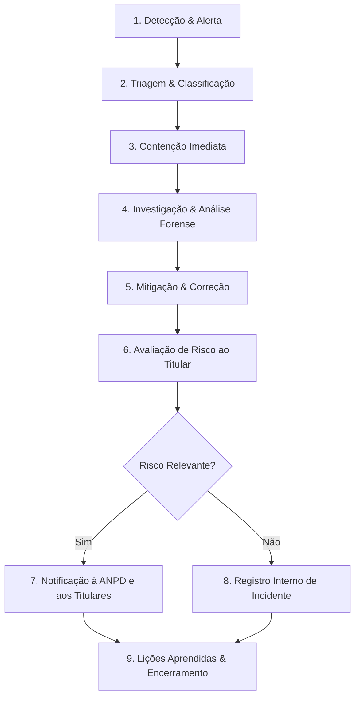

# ATLASFIT — PLANO DE RESPOSTA A INCIDENTES DE SEGURANÇA (PRIS)

Este documento define o procedimento operacional padrão para identificação, contenção, investigação, mitigação e comunicação de incidentes de segurança da informação envolvendo dados pessoais na plataforma AtlasFit, em conformidade com o Art. 48 da LGPD e regulamentação da ANPD.

---

## 1. Níveis de Severidade de Incidentes

| Nível | Definição | Exemplo | Prazo de Ação Inicial |
| :--- | :--- | :--- | :--- |
| **BAIXO (LOW)** | Evento sem exposição de dados pessoais nem comprometimento de sistemas | Tentativa de força bruta bloqueada pelo rate limit | Até 24 horas |
| **MÉDIO (MEDIUM)** | Falha pontual em componente interno sem vazamento de dados sensíveis | Erro em rota de webhook sem impacto a terceiros | Até 8 horas |
| **ALTO (HIGH)** | Acesso não autorizado a dados pessoais de múltiplos usuários | Vulnerabilidade IDOR explorada com vazamento de dados cadastrais | Até 2 horas |
| **CRÍTICO (CRITICAL)** | Vazamento ou comprometimento de dados sensíveis de saúde, senhas ou credenciais de pagamento | Exposição de banco de dados ou bucket Cloudflare R2 | **Imediato (< 1 hora)** |

---

## 2. Fluxo Operacional de Resposta

---

## 3. Comunicação à ANPD e aos Titulares Afetados

- **Prazo de Comunicação à ANPD:** A regulamentação da ANPD estabelece que a comunicação deve ser feita no prazo de **3 (três) dias úteis**, contados do conhecimento de que o incidente afetou dados pessoais de forma relevante.
- **Conteúdo Mínimo da Notificação:**
  1. Descrição da natureza dos dados pessoais afetados (cadastrais, financeiros, dados de saúde/fotos).
  2. Informações sobre os titulares envolvidos e quantidade aproximada.
  3. Indicação das medidas de segurança técnicas e administrativas utilizadas.
  4. Riscos relacionados ao incidente.
  5. Medidas que foram ou serão adotadas para reverter ou mitigar os efeitos do prejuízo.
  6. Contato do Encarregado de Dados (DPO) para esclarecimentos.

---

## 4. Registro no Banco de Dados (`SecurityIncident`)
Todos os incidentes detectados são registrados na tabela `SecurityIncident` para fins de auditoria, acompanhamento e conformidade com o dever de prestação de contas (*accountability*, Art. 6º, X da LGPD).
